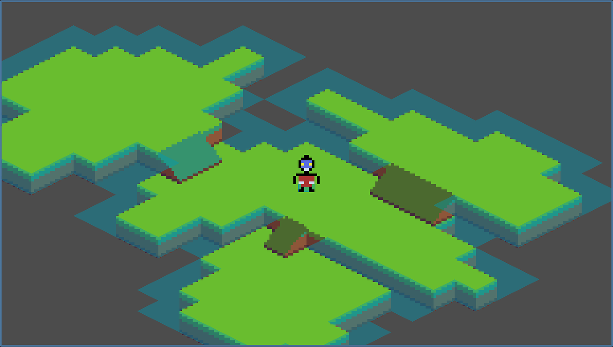

# Isometric Playground

This is a simple playground to test with isometric tilemaps. It was done following the youtube tutorial at [How to Make an Isometric TileMap | Godot 4 | Tutorial - YouTube](https://www.youtube.com/watch?v=wLldN3KX0dI)

The tile pixel art images was created using [GitHub - Orama-Interactive/Pixelorama: Unleash your creativity with Pixelorama, a powerful and accessible open-source pixel art multitool. Whether you want to create sprites, tiles, animations, or just express yourself in the language of pixel art, this software will realize your pixel-perfect dreams with a vast toolbox of features. Available on Windows, Linux, macOS and the Web!](https://github.com/Orama-Interactive/Pixelorama)

## Note

- Don't forget to set the inclined tiles `z-index` to 1 to stay in front of the flat ones.

- The trick that makes the player being forbidden the empty tiles is that they are the only tiles for which a `Physics Layer 0` collision shape has been defined. Because the Collision Layer for that physics layer is set to 1 and the player also has 1 those tiles cannot be passed by the player.
